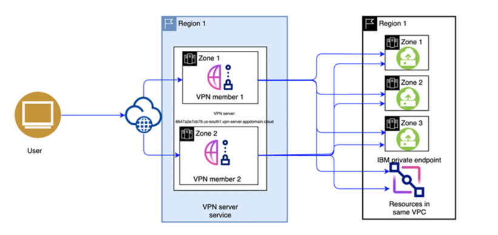

# Client to Site VPN Module

[-brightgreen)](https://terraform-ibm-modules.github.io/documentation/#/badge-status)
[](https://github.com/pre-commit/pre-commit)
[](https://github.com/terraform-ibm-modules/terraform-ibm-client-to-site-vpn/releases/latest)
[](https://renovatebot.com/)
[](https://github.com/semantic-release/semantic-release)

This module automates the provisioning of a client-to-site VPN in a VPC cluster. For more information, see [About client-to-site VPN servers](https://cloud.ibm.com/docs/vpc?topic=vpc-vpn-client-to-site-overview) in the IBM Cloud docs.

<!-- BEGIN OVERVIEW HOOK -->
## Overview
* [terraform-ibm-client-to-site-vpn](#terraform-ibm-client-to-site-vpn)
* [Examples](./examples)
    * [Basic example creating a standalone VPN server](./examples/basic)
    * [Complete example creating a high availability VPN server](./examples/ha-complete)
* [Contributing](#contributing)
<!-- END OVERVIEW HOOK -->

## terraform-ibm-client-to-site-vpn

### Network topology

The VPN server is deployed in a selected multizone (MZR) region and VPC.



### Considerations

- **Scaling considerations**: The aggregation bandwidth for the stand-alone VPN is 600 Mbps and for the high availability VPN is 1200 Mbps.
- **Client IPv4 address pool**: The client-to-site VPN assigns an IP address to the connecting client from the client IPv4 address pool (CIDR Range). This CIDR range must not overlap with VPC address prefixes.
- **Subnets**: This module supports creation of both stand-alone and high availability VPN servers. The stand-alone VPN server needs one subnet while the two subnets are required for High availability VPN servers.
- **VPN Server authentication**: The VPN server certificate is needed at the time of provisioning of the VPN server. The server certificate CRN in the IBM Cloud Secrets Manager is required.
- **VPN Client authentication**: The client authentication method is required at the time of provisioning of the VPN server. The VPN server supports "username" based authentication. There is no support for the "certificate" based authentication at this point of time.
- **Split tunnel mode**: This module provisions a client-to-site VPN with the split tunnel mode. When the VPN connection is set up, an encrypted tunnel is created over the internet to the VPN server. The split tunnel mode supports sending private traffic that is destined to the VPC inside the VPN tunnel and sending public traffic (internet traffic) outside the VPN tunnel.
- **Accessing the VPC clusters**: Set CIDR blocks to allow VPN access to your VPC cluster through either the private service endpoint or the Virtual Private Endpoint Gateway. Specify the block in the `vpn_server_routes` input. For more information about the routes, see [Accessing clusters through the private cloud service endpoint](https://cloud.ibm.com/docs/openshift?topic=openshift-access_cluster#access_private_se) and [through the Virtual Private Endpoint Gateway](https://cloud.ibm.com/docs/openshift?topic=openshift-access_cluster#vpc_vpe).

### Setting up a client VPN environment and connecting to a VPN server

This module has an option to provision access group, policy and users to connect to the VPN when `create_policy` flag is true. Provide list of users needed Client to Site VPN access in the `cts_vpn_access_group_users` variable.

Once Client to Site VPN is deployed with access groups, follow these steps:

1.  On the VPN server page, go to the Clients tab, and then click **Download client profile** to download the client configuration file (`<vpn_server>.ovpn`).
1.  Download and install the OpenVPN client.
1.  Import this configuration file in the OpenVPN client and connect to the client-to-site VPN server.
1.  Add users to the access group either in IAM dashboard or by adding users' email id to `var.vpn_client_access_group_users`.
1.  Go to https://iam.cloud.ibm.com/identity/passcode to generate the passcode.

#### VPN server limitations

For more information about the current VPN server limitations, see [VPN server limitations](https://cloud.ibm.com/docs/vpc?topic=vpc-vpn-client-vpn-limitations&interface=ui).

#### Deployable architecture extension
See [Client-To-Site VPN add-on for landing zone](extensions/landing-zone)

### Usage

```hcl
module "client_to_site_vpn" {
  source                       = "terraform-ibm-modules/client-to-site-vpn/ibm"
  version                      = "X.X.X" # Replace "X.X.X" with a release version to lock into a specific release
  server_cert_crn              = "crn:<...>" # CRN to a server secret or certificate in Secrets Manager
  vpn_gateway_name             = "example-vpn"
  resource_group_id            = "65xxxxxxxxxxxxxxxa3fd"
  secrets_manager_id           = "839fxxxx-xxxx-xxxx-xxxx-xxxxxxx913b9"
  subnet_ids                   = ["0726-ec96c7cd-46f4-4969-9009-7613f8e9e93"] # A list of IDs of subnets dedicated to the VPN in the VPC.
}
```

### Required IAM access policies
You need the following permissions to run this module.

- IAM services
    - **VPC Infrastructure** services
        - `Editor` platform access
    - **No service access**
        - **Resource Group** \<your resource group>
        - `Viewer` resource group access

<!-- Below content is automatically populated via pre-commit hook -->
<!-- BEGINNING OF PRE-COMMIT-TERRAFORM DOCS HOOK -->
### Requirements

| Name | Version |
|------|---------|
| <a name="requirement_terraform"></a> [terraform](#requirement\_terraform) | >= 1.0.0, <1.6.0 |
| <a name="requirement_ibm"></a> [ibm](#requirement\_ibm) | >= 1.57.0, < 2.0.0 |
| <a name="requirement_time"></a> [time](#requirement\_time) | >= 0.9.1, < 1.0.0 |

### Modules

No modules.

### Resources

| Name | Type |
|------|------|
| [ibm_iam_access_group.cts_vpn_access_group](https://registry.terraform.io/providers/ibm-cloud/ibm/latest/docs/resources/iam_access_group) | resource |
| [ibm_iam_access_group_members.cts_vpn_access_group_users](https://registry.terraform.io/providers/ibm-cloud/ibm/latest/docs/resources/iam_access_group_members) | resource |
| [ibm_iam_access_group_policy.cts_vpn_access_group_policy](https://registry.terraform.io/providers/ibm-cloud/ibm/latest/docs/resources/iam_access_group_policy) | resource |
| [ibm_iam_authorization_policy.policy](https://registry.terraform.io/providers/ibm-cloud/ibm/latest/docs/resources/iam_authorization_policy) | resource |
| [ibm_is_vpn_server.vpn](https://registry.terraform.io/providers/ibm-cloud/ibm/latest/docs/resources/is_vpn_server) | resource |
| [ibm_is_vpn_server_route.server_route](https://registry.terraform.io/providers/ibm-cloud/ibm/latest/docs/resources/is_vpn_server_route) | resource |
| [time_sleep.wait_for_authorization_policy](https://registry.terraform.io/providers/hashicorp/time/latest/docs/resources/sleep) | resource |

### Inputs

| Name | Description | Type | Default | Required |
|------|-------------|------|---------|:--------:|
| <a name="input_access_group_name"></a> [access\_group\_name](#input\_access\_group\_name) | Name of the IAM Access Group to create if var.create\_policy is true | `string` | `"client-to-site-vpn-access-group"` | no |
| <a name="input_client_auth_methods"></a> [client\_auth\_methods](#input\_client\_auth\_methods) | Client authentication method | `string` | `"username"` | no |
| <a name="input_client_dns_server_ips"></a> [client\_dns\_server\_ips](#input\_client\_dns\_server\_ips) | DNS server addresses that will be provided to VPN clients connected to this VPN server | `list(string)` | `[]` | no |
| <a name="input_client_idle_timeout"></a> [client\_idle\_timeout](#input\_client\_idle\_timeout) | The seconds a VPN client can be idle before this VPN server will disconnect it. Default set to 30m (1800 secs). Specify 0 to prevent the server from disconnecting idle clients. | `number` | `1800` | no |
| <a name="input_client_ip_pool"></a> [client\_ip\_pool](#input\_client\_ip\_pool) | The VPN client IPv4 address pool, expressed in CIDR format. The request must not overlap with any existing address prefixes in the VPC or any of the following reserved address ranges: - 127.0.0.0/8 (IPv4 loopback addresses) - 161.26.0.0/16 (IBM services) - 166.8.0.0/14 (Cloud Service Endpoints) - 169.254.0.0/16 (IPv4 link-local addresses) - 224.0.0.0/4 (IPv4 multicast addresses). The prefix length of the client IP address pool's CIDR must be between /9 (8,388,608 addresses) and /22 (1024 addresses). A CIDR block that contains twice the number of IP addresses that are required to enable the maximum number of concurrent connections is recommended. | `string` | `"10.0.0.0/20"` | no |
| <a name="input_create_policy"></a> [create\_policy](#input\_create\_policy) | Set to true to create a new access group (using the value of var.access\_group\_name) with a VPN Client role | `bool` | `true` | no |
| <a name="input_create_s2s_auth_policy"></a> [create\_s2s\_auth\_policy](#input\_create\_s2s\_auth\_policy) | Create IAM Service to Service Authorization to allow communication between all VPN Servers (scoped to the given resource group) and the given Secrets Manager instance. Currently not possible to scope the policy to the exact VPN server ID since the policy is needed before the instance exists as it uses the cert stored in secrets manager during the provisioning process. | `bool` | `true` | no |
| <a name="input_enable_split_tunneling"></a> [enable\_split\_tunneling](#input\_enable\_split\_tunneling) | Enables split tunnel mode for the Client to Site VPN server | `bool` | `true` | no |
| <a name="input_resource_group_id"></a> [resource\_group\_id](#input\_resource\_group\_id) | ID of the resource group to use when creating the VPN server | `string` | n/a | yes |
| <a name="input_secrets_manager_id"></a> [secrets\_manager\_id](#input\_secrets\_manager\_id) | ID of the Secrets Manager that contains the certificate to use for the VPN, only required when create\_s2s\_auth\_policy is true. | `string` | `null` | no |
| <a name="input_server_cert_crn"></a> [server\_cert\_crn](#input\_server\_cert\_crn) | CRN of a secret in Secrets Manager that contains the certificate to use for the VPN | `string` | n/a | yes |
| <a name="input_subnet_ids"></a> [subnet\_ids](#input\_subnet\_ids) | List of subnet IDs to provision this VPN server in. List must have at least 1 subnet ID for standalone VPN and at least 2 subnet IDs for the High Availability mode. | `list(string)` | n/a | yes |
| <a name="input_vpn_client_access_group_users"></a> [vpn\_client\_access\_group\_users](#input\_vpn\_client\_access\_group\_users) | List of users to optionally add to the Client to Site VPN Access Group if var.create\_policy is true | `list(string)` | `[]` | no |
| <a name="input_vpn_gateway_name"></a> [vpn\_gateway\_name](#input\_vpn\_gateway\_name) | The user-defined name for the VPN server. If unspecified, the name will be a hyphenated list of randomly-selected words. Names must be unique within the VPC the VPN server is serving. | `string` | n/a | yes |
| <a name="input_vpn_server_routes"></a> [vpn\_server\_routes](#input\_vpn\_server\_routes) | Map of server routes to be added to created VPN server. | <pre>map(object({<br>    destination = string<br>    action      = string<br>  }))</pre> | `{}` | no |

### Outputs

| Name | Description |
|------|-------------|
| <a name="output_vpn_server_certificate_secret_crn"></a> [vpn\_server\_certificate\_secret\_crn](#output\_vpn\_server\_certificate\_secret\_crn) | CRN of the client to site vpn server certificate secret stored in Secrets Manager |
| <a name="output_vpn_server_id"></a> [vpn\_server\_id](#output\_vpn\_server\_id) | Client to Site VPN ID |
<!-- END OF PRE-COMMIT-TERRAFORM DOCS HOOK -->

<!-- Leave this section as is so that your module has a link to local development environment set up steps for contributors to follow -->
## Contributing

You can report issues and request features for this module in GitHub issues in the module repo. See [Report an issue or request a feature](https://github.com/terraform-ibm-modules/.github/blob/main/.github/SUPPORT.md).

To set up your local development environment, see [Local development setup](https://terraform-ibm-modules.github.io/documentation/#/local-dev-setup) in the project documentation.
