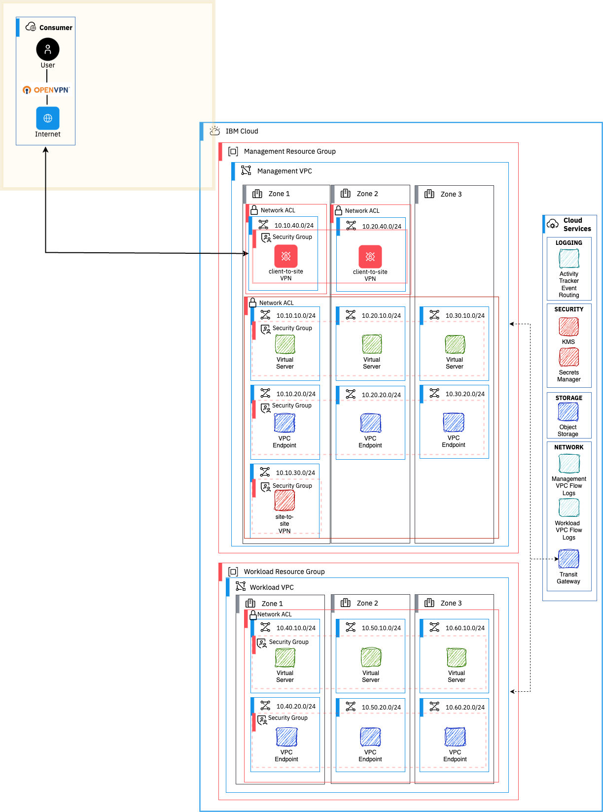

# Client-To-Site VPN add-on for landing zone

A module creating a single-zone VPN client-to-site gateway in an existing landing-zone management VPC.

The default values in this module are designed to work against the default values used in the landing-zone module (all 3 variations: VPC, OpenShift and VSI).

## Infrastructure

This module creates and configures the following infrastucture:
- A Secret Manager instance ( Optional - a reference to an existing Secret Manager instance can be passed via the `existing_sm_instance_guid` input variable )
   - A [private certificate engine](https://cloud.ibm.com/docs/secrets-manager?topic=secrets-manager-prepare-create-certificates) is configured in the Secret Manager instance.
   - A secret group is created.
   - A private certificate (the "secret") using the prvate certificate engine is created in the secret group created above
- A subnet named 'client-to-site-subnet' in the landing-zone management VPC
   - The network ACL on this subnet grants all access from any source
- A new security group named 'client-to-site-sg' that allows all incoming request from any source
- An IAM access group allowing users to authenticate and connect to the client-to-site VPN gateway
- A client-to-site VPN gateway:
   - Using the private certificate generated above and stored in the Secret Manager instance
   - The gateway is located in the 'client-to-site-subnet' subnet mentioned
   - Attaches the 'client-to-site-sg' to the client-to-site VPN gateway
   - With routes configured to allow accessing the landing zone VPCs (management and workload)

## Usage

Here is an example creating a client-to-site VPN gateway a VPC with id `r018-dd5f14c5-2211-43c8-85d9-71b6d051de51` (replace with the id of the landing-zone management VPC). Access to the VPN is given to the users specified in the `vpn_client_access_group_users` variable.

Note: the users must already be member of the IBM Cloud account that

```console
terraform init
export TF_VAR_ibmcloud_api_key=<your IBM Cloud API Key> # pragma: allowlist secret
terraform plan -var=region=eu-gb -var=vpn_client_access_group_users='["user1@ibm.com", "user2@gmail.com"]' -var=vpc_id=r018-dd5f14c5-2211-43c8-85d9-71b6d051de51
terraform apply -var=region=eu-gb -var=vpn_client_access_group_users='["user1@ibm.com", "user2@gmail.com"]' -var=vpc_id=r018-dd5f14c5-2211-43c8-85d9-71b6d051de51
```

## Connecting to the VPN gateway

Once the client-to-site VPN gateway is set up, you can connect following the steps:
1. Install OpenVPN Client on your machine. See the links at https://cloud.ibm.com/docs/vpc?topic=vpc-setting-up-vpn-client
2. In the IBM Cloud Console:
   1. navigate to VPC infrastructure -> VPNs -> Client-to-site servers and select the client-to-site VPN server that was created
   2. Under the "Clients" tab, click "Download client profile
3. Open the OpenVPN Client on your machine, and drag and drop the client profile file that was downloaded in the previous step
4. At the first connection in OpenVPN client enter the following information:
   1. Username: a full email address
   2. Password: passcode obtained from https://iam.cloud.ibm.com/identity/passcode #pragma: allowlist secret
   3. Click "continue" when prompted for a certificate (there is no need for a certificate)

At this point you should be able to reach any of the workload in the management VPC, including the OpenShift Web Console (management cluster only for now - an enhancement to this module is coming to give access to the workload cluster as well).
